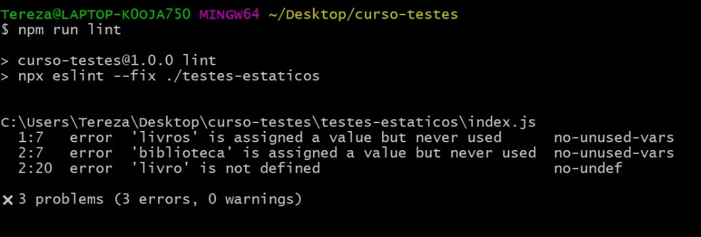

# On16-TodasEmTech-S15-Automacao-Testes

Fala, galera! Tudo bem? Meu nome é Tereza e eu serei a instrutora da aula de Automação de Testes. 

[Clique aqui](https://github.com/reprograma/On16-TodasEmTech-S15-Automacao-Testes/blob/main/material%20aula/Automa%C3%A7%C3%A3o%20de%20Testes%20-%20reprograma.pdf), para acessar o material da aula. 

O nível da nossa aula é introdutório, onde aprenderemos o que é e como fazer testes desde a fase inicial de construção de uma aplicação (teste unitário), como também na fase de um projeto já pronto e estruturado (teste de API). Vamos entender os tipos e regras de testes, conceitos que envolvem qualidade, investimentos e a famosa pirâmide de testes. 

Nós iremos colocar a mão no código, padronizando códigos com o ESLint e criando testes com as ferramentas Jest e Supertest.

Durante a aula, nós vamos utilizar dois projetos:

- O diretório projeto1 será para testes estáticos e unitários. Vamos criar alguns códigos, padronizar e fazer leitura de testes usando ESLint, e fazer testes manuais construindo um framework. 

- O segundo projeto será para teste de API, nos guiaremos com o arquivo md ``testesAPI.md``. Se observarem, é a mesma API Livraria que praticamos na aula [Integração Banco de Dabos](https://github.com/reprograma/On16-TodasEmTech-S12-Intro-BD). O objetivo é testar os endpoints que elaboramos. Aprenderemos como testar com a ferramenta Jest.

----------------------------------------

## ATIVIDADE PARA CASA

A atividade para casa será reproduzir os testes na mesma API que você utilizou na atividade da aula Integração Banco de Dados. Você deverá seguir o passo a passo do teste de API, que está no arquivo ``testeAPI.md`` e aplicar na API de sua escolha.

A atividade será avaliada nos seguintes critérios:

- Criação de pasta e arquivo de test;

- Estutura de código para teste das rotas da API;

- Sintaxe de testes usando describe e matchers;

- Uso do Jest e ESLint.

------------------------------------------------------------------------

## Testes Estáticos e Unitários - ``projeto1``

Vamos começar a nossa primeira experiência com testes, é muito importante darmos uma atenção aos testes que já estão presentes nas primeiras etapas do desenvolvimento de códigos, antes da aplicação ser executada. Chamamos de testes estáticos.

Teste estático, é uma análise feita nos artefatos de uma aplicação, ou seja, as unidades físicas de execução da aplicação, alguns exemplos são os requisitos, estória de usuário, arquitetura e o código-fonte do projeto. 

Esse tipo de teste visa garantir uma padronização ortográfica, evitando defeitos por erros de escrita e sintaxe inadequada. 

A grande característica do teste estático é que ele é feito sem a execução do código, ele pode ser feito manualmente como forma de revisão (um colega pode revisar seu código procurando erros) e pode ser feita como análise estática com o uso de ferramentas. Ferramentas assim são do tipo lint. Podemos encontrar ferramentas lint para variadas linguagens de programação. 
Nesta aula, usaremos o lint ``ESLint``.

### Instalando o ESLint

Vamos instalar o ESLint como "dev dependencie", pois vamos usa-lo apenas enquanto no processo de desenvolvimento. Nesta aula vamos usar a versão 8.16.0, para evitar risco de atualização de versão e divergências na execução do projeto, vamos usar o comando ``--save-exact``, que garante manter exatamente a versão escolhida. 

```js
npm install --save-dev eslint@8.16.0 --save-exact
```

Agora vamos executar o ESLint com o comando:

```js
npx eslint --init
```
No terminal, será iniciado o processo de configuração do ESLint e aparecerão algumas perguntas. Você pode "customizar" o ESLint de acordo com a necessidade do seu projeto. 

Para esta aula, configuramos o ESLint da seguinte forma:

- √ How would you like to use ESLint? · style
- √ What type of modules does your project use? · commonjs
- √ Which framework does your project use? · none
- √ Does your project use TypeScript? · No
- √ Where does your code run? · node
- √ How would you like to define a style for your project? · guide
- √ Which style guide do you want to follow? · airbnb
- √ What format do you want your config file to be in? · JSON
- √ Would you like to install them now? · Yes
- √ Which package manager do you want to use? · npm

Após a conclusão da intalação, na raiz do projeto será criado o arquivo ``.eslintrc.json``, um JSON contendo os dados que definimos no processo de configuração. 

### Aprendendo a ler testes estáticos

No diretório do curso, dentro da pasta ``teste-estático``, vamos criar um arquivo chamado ``index.js``. Iremos criar uma função simples para simular soma de compras e taxa de entrega.

Após a fazermos a instalação, foi criado um arquivo chamado .eslintrc.json, que logo mais iremos dar uma olhada. 

No arquivo package.json, vamos adicionar um script para executar o ESLint na pasta que criamos ``teste-estático`` que ficará assim:

```js
  "scripts": {
    "lint": "npx eslint --fix ./testes-estaticos",
    "test": "echo \"Error: no test specified\" && exit 1"
  },
``` 

No arquivo ``index.js``, vamos criar um trecho de código para executarmos o eslint, colocaremos um erro de grafia propositalmente. 

```js 
const livros = 3;
const biblioteca = livro + 1;
```

Vamos executar o comando lint no terminal:

```js
npm run lint
```

No terminal, o resultado poderá ser semelhante a imagem abaixo.

<center><Logotipo demostração de erro de identação do código no arquivo index.js no terminal, fundo preto e letras de cor branca></center>

Ao executarmos o comando, o ESLinte irá gerar um resumo da análise de erro, vamos aprender a fazer a leitura dessa validação, cada linha de erro é composta de blocos de informações. 

- A linha e coluna do erro é informada logo no início, para facilitar a localização; 
- Em seguida temos a identificação se é um erro ou um alerta (podemos configurar isso);
- Em seguida temos a mensagem detalhando o problema que será corrigido; 
- Por último, a regra que esse erro pertence (também iremos configurar).

No terminal, observamos que o ESLinte analisou nosso código e identificou os seguintes erros: 
 
- Na linha 1:7 diz que a variável “livros” teve valor atribuído mas não foi utilizada.
- Na linha 2:7 diz que  a variável “biblioteca” teve valor atribuído mas não foi utilizada.
- Na linha 2:20 diz que a variável “livro” não foi definida (justamente o erro proposital que criamos e que impactou em todo restante do código).

Vamos manter esse erro e testar um pouco mais a frente.

### Plugin VSCode - ESLint

Apesar do relatório gerado pelo comando ``npm run lint`` ser muito eficiente, é possível melhorar ainda mais nossa produtividade nos testes estáticos. No VSCODE é possível instalar o plugin do ESLint, ao instalarmos somos alertados em tempo real dos erros existentes no código. 

Instale o plugin e observe o código novamente. Veremos que os mesmos erros mostrados no relatório do terminal, estão sinalizados em vermelho. Se passarmos o mouse por cima, veremos uma mensagem sinalizando o erro. 


### Testes unitários - cenário de teste

Agora que entendemos como aplicar uma ferramenta de análise estática em nosso ambiente de desenvolvimento, podemos começar a entender como funciona a criação de cenários para testes. 

Iremos aprender a fazer uma simulação simples de teste e criaremos um cenário para aplicação através de um mini framework de testes. Essa aula será importante para entender como os testes funcionam sem o uso de ferramenta, tendo a experiência de simular um teste manualmente. 

Dentro da pasta ``testes-unitarios``, você encontrará o arquivo ``teste-framework.js``

No arquivo existe a função ``somaCompra``, essa função recebe dois parâmetros “livroSelecionado” e “carrinho”, o objetivo dela é somar o valor dos livros selecionados na plataforma da livraria e somar com a taxa de entrega. 

Para conferir se a função está somando corretamente, foi atribuido o bloco "if/else" para executar o teste de validação, usando a variável chamada ``esperado``que recebe o 
resultado da soma das compras.

```js
const somaCompras = (livroSelecionado, taxaEntrega) => {
  return livroSelecionado + taxaEntrega;
};

let esperado = 55;
let retorno = somaCompras(50, 5);

if (esperado === retorno) {
  console.log(`O teste deu certo :)`);
} else {
  console.error(`O teste deu ruim :(`);
}
```

Na linha seguinte, existe uma outra função chamada estoque, que recebe os parâmetros ``livroEstoque`` e ``livroSelecionado``, ela tem a tarefa de calcular a diferença disponível no estoque após a saída de uma certa quantidade de livros.

```js
const estoque = (livroEstoque, livroSelecionado) => {
  return livroEstoque - livroSelecionado;
};

esperado = 5;
retorno = estoque(10, 5);
if (esperado === retorno) {
  console.log(`O teste deu certo :)`);
} else {
  console.error(`O teste deu ruim :(`);
}
```

Vamos executar o teste?  Digite no terminal o comando
 
```js
node teste-framework.js 
```

Para testar se ele reconhece se o cálculo está errado, podemos alterar o sinal de adição (+) para subtração (-) na função que criamos de somaCompras, e executar o teste novamente. 

O comportamento está sendo o esperado, porém, considerando num projeto maior, se houver uma falha, não saberemos de onde está partindo o erro. Por esse motivo, precisaremos refatorar o código do arquivo ``teste-framework.js`` vamos criar uma variável chamada teste, ela receberá um parâmetro chamado “titulo”, também incluiremos os parâmetros "retorno” e “esperado”, eles serão úteis para nominar o teste quando executarmos. 

Vamos também simplificar nosso código para um único if/else, e por fim, iremos atribuir os valores de entrada com a nova variável. Conseguiremos usar para o teste das funções somaCompras e estoque. 

```js
const somaCompras = (livroSelecionado, taxaEntrega) => {
  return livroSelecionado + taxaEntrega;
};

const estoque = (livroEstoque, livroSelecionado) => {
  return livroEstoque - livroSelecionado;
};

const teste = (titulo, esperado, retornado) => {
  if (esperado === retornado) {
    console.log(` ${titulo} deu certo :)`);
  } else {
    console.log(` ${titulo} deu ruim :(`);
  }
};

teste("somaCompras", 10, somaCompras(5, 5));
teste("estoque", 30, estoque(50, 20));
```

Agora vamos executar o framework novamente no terminal, e observar o resultado:

```js
node teste-framework.js 
```

Agora conseguimos ter um retorno mais preciso, sinalizando exatamente de onde está partindo o resultado do teste.  


### Testes unitários com Jest

Chegamos numa etapa importante dos testes, nós vamos conhecer a ferramenta de teste mais conhecida da comunidade JavaScript, que é o Jest. 

Ele foi inicialmente desenvolvido pelo Facebook para testar o framework React, porém ganhou tanta destaque que também é usado com TypeScript, Node, Angular, Vue entre outros.

Além de ser seguro, o Jest tem uma documentação com orientações claras e objetivas.

Vamos iniciar o processo seguindo alguns passos:

- Instalamos o jest como devDependencies

```js
npm install --save-exact jest@28.1.0 --save-dev
```

- Vamos modificar o script "test" que já existe dentro do arquivo package-json, iremos modificar para executar o Jest. 

```js
“test”: “jest”
``` 

Agora podemos fazer nossos testes automatizados com o Jest. Vamos usar o exemplo do framework de teste que criamos anteriormente, precisaremos copiar as funções "somaCompras" e "estoque".

Dentro da pasta ``testes-unitarios`` criaremos o arquivo ``compras.js``, dentro do arquivo vamos colar apenas a função "somaCompras" e exportar com o método "module.exports".

```js
const somaCompras = (livroSelecionado, taxaEntrega) => {
  return livroSelecionado + taxaEntrega;
}

module.exports = somaCompras;
```

Criaremos o arquivo ``estoque.js``, vamos colar apenas a função "estoque" e exportar com o método "module.exports".

```js
const estoque = (livroEstoque, livroVendido) => {
  return livroEstoque - livroVendido;
}

module.exports = estoque;
```

Na raiz do projeto1, criaremos uma pasta chamada ``test`` e dentro dela, criaremos o arquivo chamado ``vendas.test.js``. No arquivo iremos estruturar nosso código de teste do framework. Iremos utilizar os método ``expect`` e o [matcher](https://jestjs.io/docs/using-matchers) ``toBe`` do Jest. 

```js
const somaCompras = require ("../testes-unitarios/compras.js");
const estoque = require ("../testes-unitarios/estoque.js");


test("Deve retornar a soma das compras com taxa de entrega", () => {
  const esperado = 2530;
  const retornado = somaCompras(2500, 30);

  expect(retornado).toBe(esperado)
});

test("Deve retornar a diferença que restou no estoque", () => {
  const esperado = 280;
  const retornado = estoque(310, 30);

  expect(retornado).toBe(esperado)
});
```

Vamos executar nosso script no terminal e fazer a leitura do nosso teste:

```js
npm run test
```

É esperado que seja feito outros testes, para evitar termos que executar sempre o Jest, podemos executar o teste no modo ``watch``, uma opção incluida no Jest que permite manter a ferramenta funcionando em tempo integral. 

Podemos atribuir a função ``--watchAll`` no script do jest, dentro do arquivo package.json. O script ficará da seguinte forma:

```js
"test:watch": "jest --watchAll"
```


